# 基于鸟鸣声景的声音识别系统

> 课程答辩 Markdown 大纲  
> 姓名：李少威  
> 学号：19230426  
> 学校：南京师范大学  
> 学院：计算机与电子信息学院 / 人工智能学院  
> 班级：2304 班  

## 1. 先说结论：结构化声学特征 + ExtraTrees 效果最好

本次实验最终得到的结论比较明确：在当前 BirdCLEF2026 小样本、多标签、噪声较强的条件下，结构化声学特征配合 ExtraTrees 的综合表现最好。它在 LRAP、Top-3 命中率和 Hamming Loss 等指标上都比较稳定，适合作为本次网页演示和报告分析的主结果。

| 指标 | 最优结果 | 说明 |
| --- | ---: | --- |
| LRAP | 0.9329 | 真实鸟类标签通常能排在候选列表前面 |
| Top-3 命中率 | 0.9878 | 适合网页端展示候选识别结果 |
| Hamming Loss | 0.0123 | 全标签维度上的误报和漏报较少 |

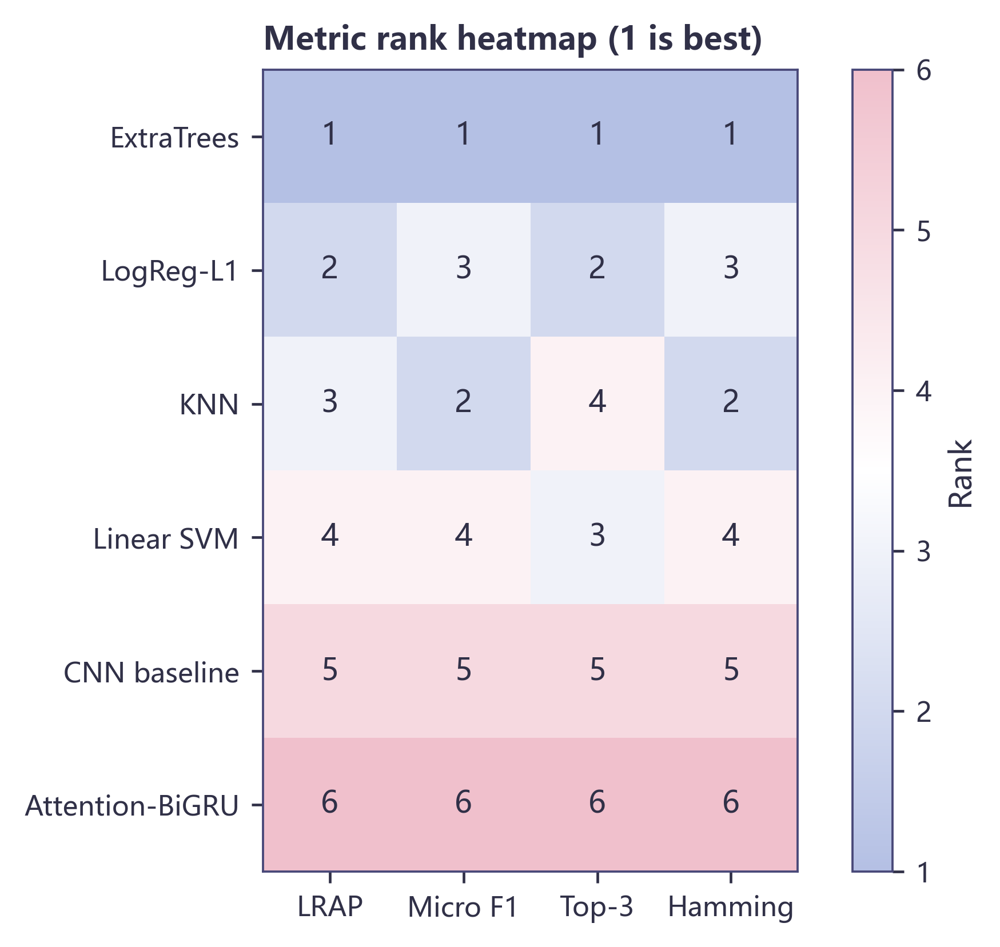

讲解时可以先把结果摆出来：我们并不是最后才说哪个模型好，而是先告诉老师，当前实验里传统声学特征路线最稳，然后再解释为什么会得到这个结果。

---

## 2. 问题从哪里来：鸟鸣识别不是普通单标签分类

普通语音识别通常关心一句话被转成什么文字，而本次任务更接近声音事件识别。一个 5 秒声景窗口里，可能同时有鸟鸣、虫鸣、风声、远处车辆声和录音设备噪声。模型要做的不是给出唯一答案，而是判断这一段声音中哪些鸟类可能出现过，并把更可信的候选类别排在前面。

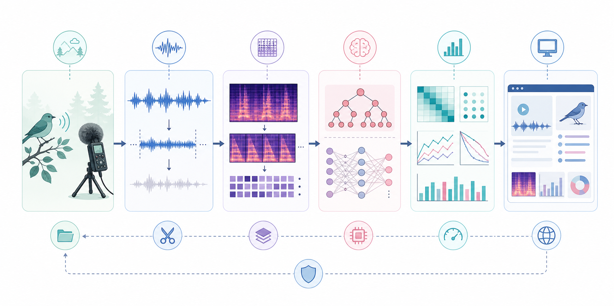

这一页主要讲任务理解：鸟鸣识别的输入是连续声景，输出是候选鸟类列表。它和单句语音识别不完全一样，所以后续模型、指标和网页展示也都围绕多标签识别来设计。

---

## 3. 数据观察：类别不均衡和多标签共现很明显

在建模之前，我们先看了数据分布。BirdCLEF2026 的声景数据有明显的类别不均衡，高频鸟类样本更多，低频鸟类样本更少。同时，一个窗口中可能出现多个标签，这说明不能简单把问题压成单标签分类。

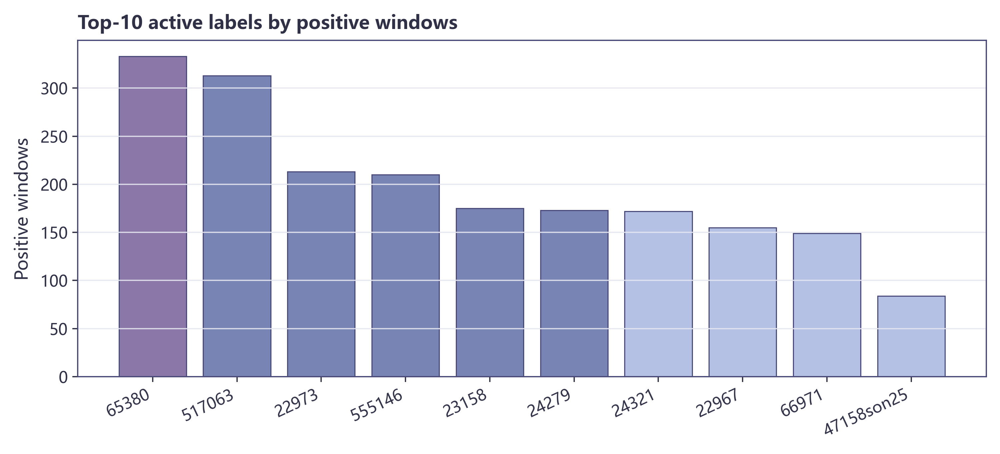

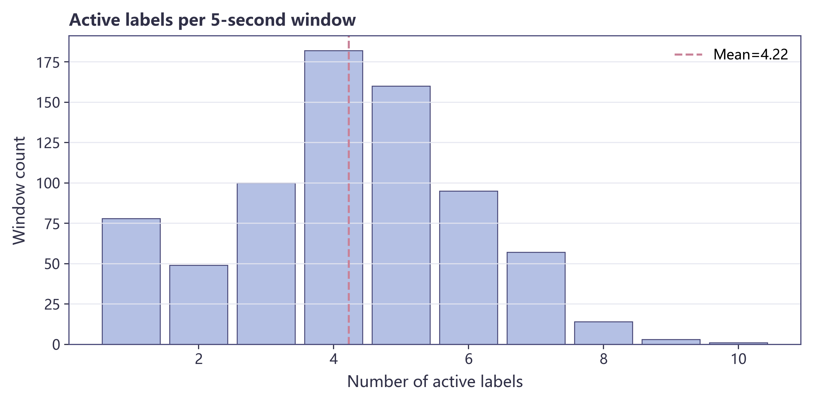

从答辩叙事上，这一页承接上一页：数据本身告诉我们，真实声景里可能同时有多个鸟类出现。如果只用单标签分类思路，模型会被迫在多个可能正确的答案中只选一个，这并不符合声音识别场景。

---

## 4. 任务转化：把连续音频切成短窗口

我们把原始音频先统一成单声道和固定采样率，再按 5 秒窗口切分。这样做有两个原因：一方面，5 秒窗口能覆盖较完整的鸟鸣事件；另一方面，窗口不会太长，避免混入过多无关背景声。

具体处理流程可以概括为：

1. 统一采样率和声道，减少录音条件差异。
2. 按 5 秒窗口切分，得到可训练的短音频片段。
3. 根据元数据构造多标签向量。
4. 模型输出每个鸟类标签的概率。
5. 网页端展示 Top-k 候选类别。

这里需要强调的是：模型处理的不是整段录音文件，而是短时声音片段；输出的也不是唯一答案，而是一组候选鸟类。这也解释了为什么后面要用 LRAP、Top-k 和 Hamming Loss，而不是只看 accuracy。

---

## 5. 特征设计：把“听感差异”变成可计算特征

声音识别不能直接停留在“听起来像什么”这个层面，而是要把声音中的差异转成模型可以学习的表示。我们保留了 MFCC、pitch、volume、timbre 和 onset/rate 等特征，它们分别对应音色、基频、响度、谱形和节奏密度。

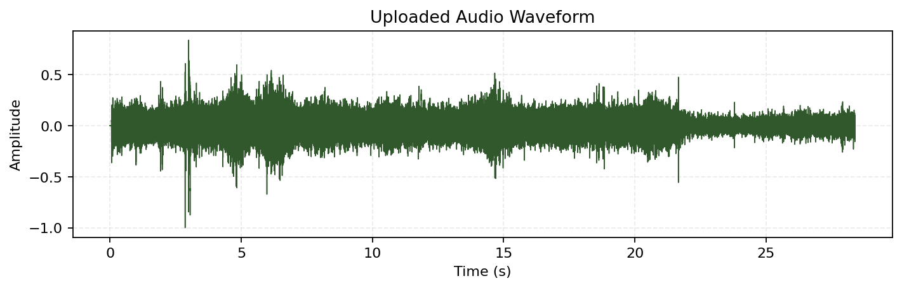

波形主要用于观察声音强弱、静音段和能量变化。它能帮助我们判断一段音频中是否存在明显鸣叫事件，也能看出背景噪声是否较强。

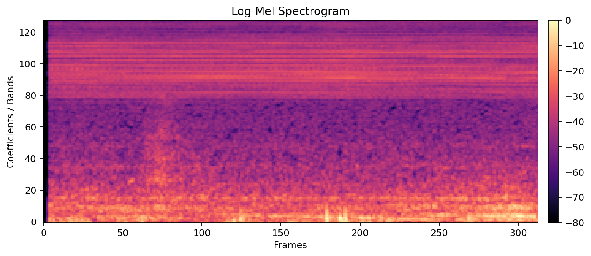

Log-Mel 频谱保留时间和频率结构，更接近人耳对频率的感知方式。鸟鸣中的高频纹理、重复条纹和持续时间，都可以在频谱图中体现出来。

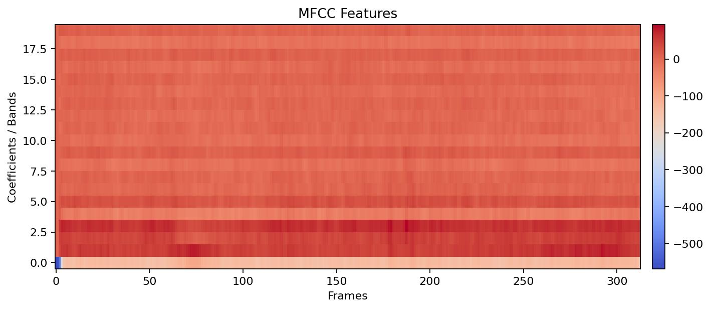

MFCC 把频谱包络压缩成较低维的倒谱系数，适合传统机器学习模型使用。它不是简单地保存原始波形，而是把声音中的谱包络信息提取出来。

---

## 6. 第一条路线：传统机器学习

传统机器学习路线并不是简单的“老方法”。在当前样本规模下，它的优势很明显：训练快、解释性强，而且对结构化声学特征比较友好。我们把每个音频窗口提取成 161 维特征，再分别训练 ExtraTrees、Logistic Regression、KNN 和 Linear SVM。

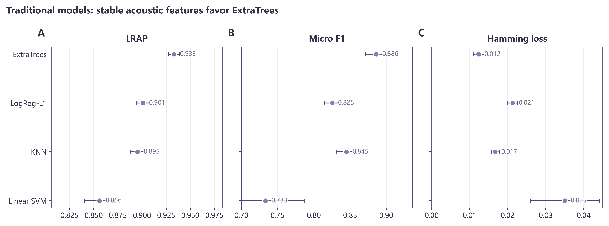

从结果看，ExtraTrees 最适合这组特征。原因在于树模型能够处理 MFCC、pitch、音量、音色和节奏统计量之间的非线性组合。Logistic Regression 和 Linear SVM 的结果也有参考价值，说明这组声学特征中确实存在一定线性可分信息；KNN 则更容易受到噪声和多标签共现的影响。

---

## 7. 第二条路线：深度学习

深度学习路线使用 Log-Mel 频谱作为输入。CNN baseline 主要学习局部时频纹理，Attention-BiGRU 进一步考虑时间顺序和片段权重。这个设计可以作为频谱端到端路线的对照。

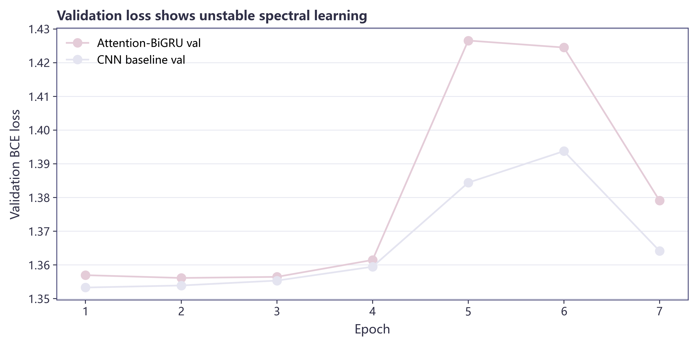

不过在当前实验规模下，深度模型没有超过传统路线。这个结果并不意外，因为 BirdCLEF 声景样本少、类别多、噪声重，轻量深度模型很难稳定学到每个鸟类的可靠纹理。相比之下，传统声学特征已经把一部分语音识别和音频识别知识提前编码进去了。

---

## 8. 怎么评价：多标签识别更关心排序质量

本次实验没有只用单一准确率评价模型，而是使用更适合多标签声音识别的指标。原因是网页最终展示的是候选列表，老师看到的是前几个可能的鸟类，而不是一个绝对唯一的类别。

| 指标 | 关注点 | 为什么适合本任务 |
| --- | --- | --- |
| LRAP | 真实标签是否排在前面 | 衡量候选排序质量 |
| Top-k 命中率 | 前 k 个候选是否覆盖真实鸟类 | 贴合网页演示 |
| Hamming Loss | 全标签维度上的误报和漏报 | 能观察整体标签错误 |
| Micro F1 | 总体预测能力 | 高频类别影响更明显 |
| Macro F1 | 各类别平均表现 | 更关注低频类别 |

这里讲解时可以强调：我们不是为了换指标而换指标，而是因为多标签声音识别更关心“候选列表有没有用”。如果真实鸟类出现在 Top-3 里，网页演示时就更有解释价值。

---

## 9. 优化过程：阈值会直接改变多标签输出

多标签任务中，阈值不是一个小细节。模型输出的是每个标签的概率，而是否把某个标签判为出现，需要依赖阈值。阈值太低，系统会给出很多不该出现的鸟类，误报增加；阈值太高，一些真实鸟鸣会被过滤掉，漏报增加。

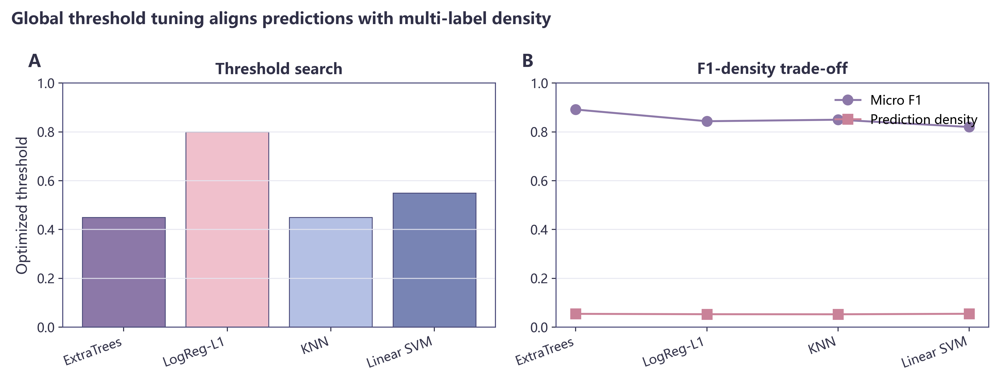

因此，我们做了阈值对照，不只看模型本身，也看输出规则怎样影响最终识别结果。这部分可以作为“发现问题、调整方法、再观察结果”的实验过程来讲，会比单纯报一个分数更自然。

---

## 10. 网页演示：把识别过程讲清楚

网页端不是只做一个上传按钮，而是把声音识别过程放在同一个界面里。用户上传音频后，系统会返回 Top-k 候选鸟类，同时展示波形、Log-Mel 频谱和 MFCC。

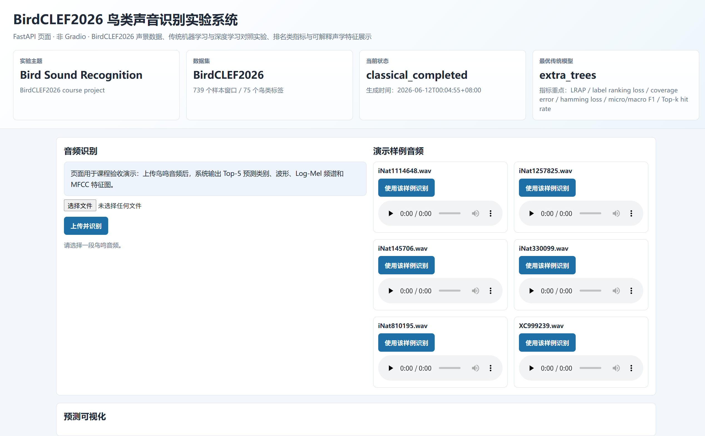

课堂演示时可以按这个顺序讲：

1. 先上传一段样例鸟鸣音频。
2. 查看系统返回的 Top-k 候选类别。
3. 看波形，解释声音强弱和静音段。
4. 看 Log-Mel 频谱，解释时间和频率结构。
5. 看 MFCC，解释为什么传统模型能使用这些声学特征。

这样老师看到的不是一个孤立网页，而是一套从声音信号处理到模型识别的完整流程。

---

## 11. 实验发现：合适的特征比盲目加深模型更关键

本次实验最重要的发现是：模型复杂度不是唯一因素。深度学习并不是不好，而是当前数据条件下不占优势。BirdCLEF 声景样本少、类别多、噪声重，轻量深度模型很难稳定学到每个鸟类的可靠纹理。

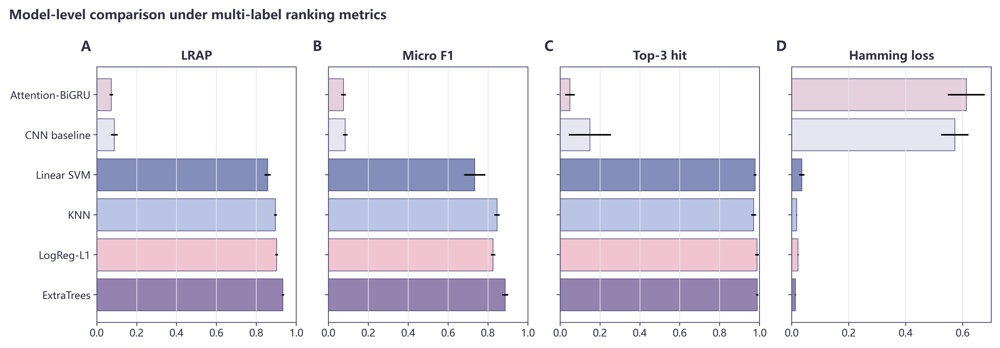

传统声学特征提前编码了频谱包络、基频、能量、音色和节奏，所以树模型更容易学到稳定关系。这个结论也比较符合课程实验场景：在样本量有限时，把声音识别知识转化为可解释特征，往往比直接堆深度模型更有效。

---

## 12. 不足与后续改进

这套实验仍然有一些限制。首先，当前监督样本数量有限，低频类别的学习不够充分。其次，阈值优化使用的是全局阈值，还没有做到每个类别单独优化。最后，网页推理目前更偏演示用途，如果追求最佳识别效果，还可以把最佳传统模型接入正式在线推理。

后续可以从两个方向继续改进：

### 数据侧

1. 增加样本量，改善低频类别表现。
2. 做更细的标签清洗，减少噪声标签影响。
3. 尝试 per-label threshold。
4. 加强噪声和混响条件下的数据增强。

### 系统侧

1. 把最佳传统模型接入正式网页推理。
2. 增加更直观的 pitch 和 onset 可视化。
3. 对 Top-k 候选提供置信度解释。
4. 后续尝试预训练音频 backbone。

---

## 13. 总结

我们从 BirdCLEF2026 声景数据出发，把连续音频切成短窗口，提取 MFCC、pitch、volume、timbre、onset/rate 等声学特征，并比较传统机器学习和深度学习路线。

最终结果表明，在当前多标签、小样本、噪声较强的条件下，结构化声学特征配合 ExtraTrees 最可靠。网页演示进一步把 Top-k 识别结果、波形、频谱和 MFCC 放在同一界面里，让声音识别过程可以被直观看到。

答辩最后可以用一句话收束：

> 这次实验完成的不是一个简单的音频上传页面，而是一套从鸟鸣声景、声学特征、模型比较到网页展示的可解释声音识别系统。

